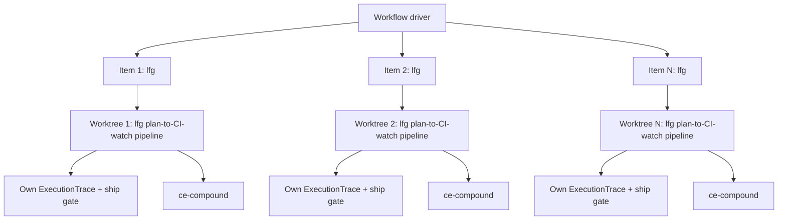
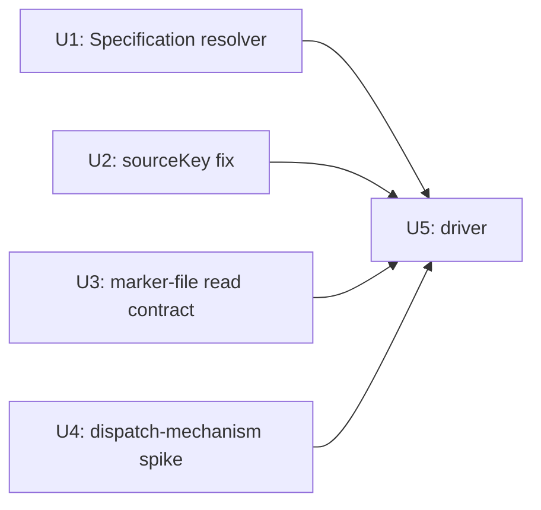

# Concurrent Multi-Feature Fan-Out - Plan

## Goal Capsule

- **Objective:** let N ready plans build concurrently, each in its own worktree, by dispatching `lfg` directly per item — its own plan → work → simplify → review-and-fix → browser-test → ship → CI-watch-and-repair pipeline, end to end — with governance attribution and lineage staying correct once builds overlap in time.
- **Product authority:** `STRATEGY.md`'s Execution scale-out track; `docs/design-briefs/ce-plugin-architecture-and-stage5-roadmap.md` section 6, Phase 1.
- **Open blockers:** none. U4's spike ran live this session (see Implementation Units) and a fresh-session re-check settled the one item it left open: `.claude/workflows/<name>` resolution confirmed (`sdk-tools.d.ts:2468`); the `Workflow` script has no filesystem access at all, confirming the driver can never write into a dispatched worktree from outside regardless of timing, which is why KTD1's self-registration design is required, not just safer — and self-registration was confirmed working live, with both test markers verified directly on disk. `agent()` dispatch of `lfg` was confirmed blocked at spike time (`"Skill lfg cannot be used with Skill tool due to disable-model-invocation"`), traced to `skills/lfg/SKILL.md`'s own `disable-model-invocation: true` flag, removed in this fork (commit `09a74ecb`). A fresh session re-ran the dispatch check and confirmed it now succeeds — R8(b) is closed. That reopened whether U5 should dispatch `lfg` directly instead of hand-assembling the chain; re-reading `lfg`'s own steps found a real mismatch — step 1 unconditionally invokes `ce-plan`, which treats an already-`implementation-ready` plan as a resume/deepening target, not a skip (`skills/ce-plan/SKILL.md:165`). Rather than treat that as a permanent reason to avoid `lfg` (this is this fork's own skill, not a fixed platform constraint), `skills/lfg/SKILL.md` step 1 was extended this session with a ready-plan bypass: when given a path to an already-implementation-ready plan, it now skips `ce-plan` and goes straight to `ce-work`. With that fix, the driver dispatches `lfg` directly per item — see the Key Decision below for the full reasoning.

**Product Contract preservation:** changed R1-R4 and added R9-R10 during `ce-plan`'s Phase 1 research (the originally hand-assembled chain never shipped anything; Verdict resolution was entirely manual). Changed again after U4's live spike: the plan's own Key Decision to dispatch `lfg` per item was reversed to hand-assembly — confirmed blocked at the time. Changed a third time this session: R8(b) re-verification confirmed `lfg` dispatch now works, and the resume/deepening mismatch that first kept the driver on hand-assembly was closed at its source by extending `skills/lfg/SKILL.md` itself (this session) rather than left as a permanent workaround. R1 reverts to dispatching `lfg` directly per item — the final v1 design.

---

## Product Contract

### Summary

A thin `Workflow` script dispatches N ready plans concurrently: each item is dispatched as `lfg <plan-path>`, in its own `isolation: "worktree"` checkout, running `lfg`'s own plan → work → simplify → review-and-fix → browser-test → ship → CI-watch-and-repair pipeline end to end, followed by `ce-compound` once `lfg` reports done. This works cleanly because `skills/lfg/SKILL.md` step 1 was extended this session with a ready-plan bypass (see Key Decision below): an already-`implementation-ready` plan skips `lfg`'s internal `ce-plan` call and goes straight to `ce-work`, so the driver can dispatch `lfg` uniformly without pre-checking readiness itself. "Shipped" follows `lfg`'s own contract: CI-confirmed-green when its bounded 3-iteration repair loop succeeds, or a PR with CI failures durably recorded in the PR body when the loop is exhausted — either way a terminal state, not an open gap. Two governance-layer fixes keep per-worktree attribution and lineage correct once builds overlap in time.

### Key Decisions

- **Target Specification id is resolved via `.by-source.json`'s existing path-keyed lookup, not a new frontmatter field.** `writeNode()` already indexes every node by the plan's repo-relative path as its `sourceKey` — a new frontmatter field embedding the id would be self-referential (the id is a hash of the file's own content, so writing it into the file invalidates it the instant it's written). Looking the id up by path avoids that trap entirely and needs no new field. `lib/governance/core.mjs` resolves the target Specification via `.by-source.json[planPath]` when the plan has a governed entry, falling back to its current newest-by-`createdAt` inference only when it's absent (legacy plans).
- **`docs/.governance/.by-source.json` merge conflicts are accepted as a documented v1 limitation, not solved by sharding.** Conflicts from concurrent worktrees are pure key additions, never overlapping values (once R9 fixes the one exception below), and are cheap to resolve by hand — sharding the index by source-key prefix adds real complexity for a narrow condition. Revisit if fan-out width grows enough that manual resolution becomes routine friction (tracked by `STRATEGY.md`'s throughput metric).
- **The driver dispatches `lfg` directly per item — the mismatch that first blocked this was fixed at its source, in this fork's own `lfg`, rather than worked around.** U4's spike dispatched `agent()` to invoke `/lfg` and got back the platform's own tool error verbatim: `"Skill lfg cannot be used with Skill tool due to disable-model-invocation"`. The cause was a line in this fork's own `skills/lfg/SKILL.md` frontmatter, not a platform restriction — removed in commit `09a74ecb`. A fresh session (post-fix, plugin cache refreshed) re-ran the same dispatch check and confirmed it now succeeds: the Skill tool loaded `lfg`'s full body with no error. That reopened the question the Key Decision originally deferred: should U5 dispatch `lfg` directly, recovering its CI-watch-and-repair step (Phase 9) for free? Re-reading `lfg`'s own steps found a real mismatch: step 1 unconditionally invoked `ce-plan` with `$ARGUMENTS`, with no branch to skip it when the target was already implementation-ready, and `ce-plan` treats an already-`implementation-ready` plan as a resume/deepening target, not a no-op (`skills/ce-plan/SKILL.md:165`) — a real, non-trivial pass (subagent research, potential plan edits), not a cheap readiness check. R4's fan-out population is specifically already-ready plans that should skip `ce-plan` entirely, so dispatching raw `lfg` as it stood would have forced every one of them through an unrequested re-deepening pass. The first pass at resolving this treated `lfg`'s own steps as fixed and kept the driver on hand-assembly, accepting no CI-watch as a permanent v1 cost. That was reconsidered: this is this fork's own skill, and the mismatch is fixable at the source, not something to route around. `skills/lfg/SKILL.md` step 1 was extended this session with a minimal, backward-compatible bypass: when `$ARGUMENTS` is a path to a plan already `artifact_contract: ce-unified-plan/v1`, `artifact_readiness: implementation-ready`, `execution: code`, `lfg` now skips invoking `ce-plan` entirely and proceeds straight to its step-1 GATE with that path (`docs/skills/lfg.md`'s reference table documents the new argument shape). Existing feature-description invocations are unaffected — no file exists at that path, so the bypass simply doesn't match and `ce-plan` runs as before. With that fix, dispatching `lfg` directly recovers its full pipeline — including CI-watch-and-repair (Phase 9) — for free, so U5 dispatches `lfg <plan-path>` per item instead of hand-assembling `ce-work → ce-simplify-code → ce-code-review → ce-commit-push-pr`. **Follow-up validation needed:** because Claude Code caches plugin/skill content at session start (the same reason R8(b) itself needed a fresh session to re-verify), this session's edit to `skills/lfg/SKILL.md` cannot be exercised live from within this same session — it needs either a fresh session or a `/skill-creator` eval run before U5 is built to depend on it (see Verification Contract).
- **Per-item outcome (shipped / blocked / errored) is read from the dispatched `lfg` run's own returned summary, not re-derived by scanning governance state.** `lfg` internally invokes `ce-commit-push-pr` (and, during its CI-watch loop, further `git commit`/`push` calls of its own) — any of these is exactly where `strict-gate.mjs`'s `PreToolUse(Bash)` hook fires: if a refuted Verdict is unresolved, the `git commit`/`push` call itself exits 2, and the dispatched agent sees that failure directly and can report it in its own returned summary, the same mechanism confirmed working when U4's `lfg`-dispatch test surfaced its own tool-level block. The driver reads that summary (including the `<promise>DONE</promise>` marker on success) rather than independently re-scanning `docs/.governance` for refuted Verdicts.
- **An unresolved refuted Verdict is a terminal "blocked" state for that item, not something the driver auto-remediates.** Matches R7 (one item's failure isolates to that item). Auto-remediation would mean building a fix-and-retry loop inside the driver from scratch — real additional scope this plan doesn't take on.
- **`openRefutedVerdicts()` stays repo-wide and unscoped for v1 — accepted as a known limitation, not fixed here, and not fixable from the driver.** Because `docs/.governance` is git-tracked and worktrees inherit history, one unresolved refuted Verdict merged to `main` blocks every worktree created afterward from that commit, not just the item that produced it. This can't be worked around by having the driver pre-filter or post-filter the check itself: `strict-gate.mjs` is a `PreToolUse(Bash)` hook that fires automatically inside whichever session runs `git commit`/`push`, a separate process the driver doesn't control (R3 already bounds the driver to dispatch only). Scoping the check genuinely requires editing `hooks/strict-gate.mjs` itself, which is outside this plan's stated scope boundary. Revisit only if this blast radius becomes routine friction in practice.

### Requirements

**Fan-out driver**

- R1. A `Workflow` script accepts a list of ready Specification ids (or `docs/plans/` paths) and, for each item, dispatches the `lfg` skill with the plan path as its argument — relying on this fork's own ready-plan bypass in `lfg` step 1 (Key Decision above) so an already-implementation-ready item skips `lfg`'s internal `ce-plan` step while a not-yet-ready item still gets enriched by it — then `ce-compound` once `lfg` reports completion.
- R2. Each item's `lfg` dispatch runs with `isolation: "worktree"`, giving one worktree per item without any change to `ce-worktree` itself.
- R3. The driver performs no engineering logic beyond dispatch, argument construction, and result collection — it does not reimplement any existing skill's behavior, and does not re-derive ship/block outcomes that the dispatched `lfg` run already reports.
- R4. The fan-out targets a small, explicit list the caller provides; v1 does not auto-discover or decide which `docs/plans/` entries are "ready" on its own. (The driver itself no longer needs to check each item's readiness before dispatch — `lfg`'s own step 1 does that internally now.)

**Governance concurrency fixes**

- R5. `lib/governance/core.mjs` resolves the target Specification id via `.by-source.json`'s existing path-keyed lookup (the plan's repo-relative path), using it in place of `latestSpecification()`'s repo-wide-newest inference; the inference remains a fallback only for plans with no governed entry yet.
- R6. Concurrent worktrees each hold their own `.by-source.json` copy; any merge conflict on reconciliation to `main` is limited to pure key additions (Key Decision above), never corrupted or lost governance state.
- R9. `emitExecutionTrace`'s `.by-source.json` sourceKey is parameterized by branch (e.g. `` `#worktree:${branch}` ``) instead of the current hardcoded literal `"#worktree"` — the one exception R6's "pure key additions" claim didn't originally cover, since two concurrent worktrees writing the same constant key is a real same-key conflict, not an addition.

**Shipping and outcome reporting**

- R10. Each item's terminal state — shipped (PR opened, reviewed, and CI-watched via `lfg`'s own bounded repair loop: CI-confirmed-green when the loop succeeds, or CI failures durably recorded in the PR body when it's exhausted), blocked (unresolved refuted Verdict causing a `git commit`/`push` call inside `lfg` to fail), or errored — is read from the dispatched `lfg` run's own returned summary and surfaced in the driver's report to the caller.

**Isolation and failure handling**

- R7. A ship-gate refutation inside one worktree blocks only that item's ship — never the other concurrently-running items.

**Validation**

- R8. Before the governance fixes are built on top of it, the fan-out driver's underlying dispatch mechanism is smoke-tested in isolation: (a) two trivial concurrent `agent()` dispatches, each confirmed to land in its own worktree, independent of R5/R6/R9; and (b) whether `agent()` dispatch can invoke a `disable-model-invocation` skill (`lfg`) at all. **Both ran live in U4 this session — R8(a) confirmed working (two distinct worktrees, distinct branches). R8(b) was blocked at spike time (`skills/lfg/SKILL.md`'s own flag), fixed in source the same session (commit `09a74ecb`), and re-confirmed working in a fresh session afterward — dispatch now succeeds. With that plus this session's `lfg` ready-plan bypass (Key Decision above), the driver dispatches `lfg` directly per item.**

### Key Flows

- F1. Concurrent fan-out execution
  - **Trigger:** caller invokes the `Workflow` script with a list of target Specification ids or plan paths.
  - **Steps:** for each item, dispatch `lfg <plan-path>` (`isolation: "worktree"`) — internally: `ce-plan` only if not already implementation-ready (via this fork's ready-plan bypass), then `ce-work → ce-simplify-code → ce-code-review-and-fix → ce-test-browser → ce-commit-push-pr → CI-watch-and-repair` — then `ce-compound` once `lfg` reports done; items run concurrently.
  - **Outcome:** each item independently reaches shipped (CI-confirmed-green, or CI failures durably recorded per `lfg`'s own bounded loop) or blocked on its own refutation; results collected and reported to the caller.
  - **Covers:** R1, R2, R3, R6, R7, R10.



### Acceptance Examples

- AE1. Given two ready Specification ids A and B dispatched concurrently, when worktree A's `ce-code-review` produces a P0 finding it cannot auto-fix, then only worktree A's ship is blocked and worktree B ships normally. Covers R7.
- AE2. Given a `docs/plans/` file with no entry yet in `.by-source.json` (a legacy plan), when the driver dispatches it, then `core.mjs` falls back to the existing `latestSpecification()` inference rather than failing the run. Covers R5.
- AE3. Given an unresolved refuted Verdict from item A merged to `main`, when a new worktree C is created afterward from that commit, then C inherits the block (accepted v1 behavior — Key Decision above) rather than shipping unaware of it.
- AE4. Given two concurrent worktrees each complete their chain, when both merge to `main`, then `.by-source.json` shows two distinct `#worktree:<branch>` keys, each still pointing at its own `ExecutionTrace`. Covers R9. (Confirmed live in U4: `worktree-wf_e35cf868-300-1` and `-2`, both real, non-detached, distinct branch names.)
- AE5. Given one real item dispatched end-to-end with no human present, when it reaches a terminal state, then that state is either shipped or an explicit reported block — never a hang on a blocking question. Covers R8, R10.

### Success Criteria

- Two independent plans run through the fan-out concurrently, each lands its own opened, reviewed, CI-watched PR via its dispatched `lfg` run (CI-confirmed-green when `lfg`'s bounded repair loop succeeds; CI failures durably recorded in the PR body when the loop is exhausted — either way a terminal state, not an open gap), and each `ExecutionTrace` links to its own Specification — not the other's. (The verification gate this plan exists to satisfy, per the design brief's Phase 1.)

### Scope Boundaries

**Deferred for later:**
- Cloud residency, unattended/scheduled triggering, and proactive proposal generation — later roadmap phases (2-4), not this plan.
- Sharding `.by-source.json` by source-key prefix — superseded by the v1 Key Decision above; revisit only if manual-conflict friction grows.
- Scoping `openRefutedVerdicts()` to the current worktree/feature (would require editing `hooks/strict-gate.mjs`) — accepted as v1 blast radius per the Key Decision above.
- ~~A CI-watch-and-repair step equivalent to `lfg`'s Phase 9~~ — no longer a gap. An earlier pass at this plan considered raw `lfg` dispatch and rejected it, because `lfg` step 1 unconditionally forced every item through a `ce-plan` resume/deepening pass even when already implementation-ready, which didn't fit R4's already-ready population. That was resolved by extending `lfg` itself with a ready-plan bypass (Key Decision above) rather than accepting the gap permanently, so dispatching `lfg` directly now recovers CI-watch-and-repair for every item. This bullet is retained only to record that the v1 design once had this gap and how it was closed.
- **Known v1 limitations surfaced by `ce-code-review`'s full-roster + cross-model adversarial pass on U1/U2/U3/U5, accepted rather than fixed this session:**
  - **`resumeFromRunId` replays a stale cached result for a previously-errored/blocked item.** Per the `Workflow` tool's own caching contract, a resumed run with unchanged `(prompt, opts)` returns the prior result instantly rather than re-dispatching — including a terminal `errored`/`blocked` result. An operator retrying a failed item via the same `args` would see the stale failure replayed, not a real retry. Fixing this needs a real design decision (what varies the prompt/opts on a deliberate retry vs. an in-progress resume) — out of scope for this pass.
  - **The `.ce-fanout-plan` marker is never cleaned up.** It's written once per dispatch and read on every Stop-hook trace for that worktree's entire lifetime — deleting it after first use was considered and rejected, since `lfg`'s own multi-step pipeline fires the Stop hook many times per dispatch and needs the marker present for all of them. If a worktree is later reused for unrelated manual work after its `lfg` run ends (worktree cleanup is itself an accepted v1 gap — R2/U5 dispatches but doesn't tear down), the stale marker could misattribute a later trace. Accepted as a v1 gap tied to the broader worktree-lifecycle gap, not fixed in isolation.
  - **A race between a dispatched agent's own Step 2 (write `.ce-fanout-plan`) and an earlier Stop-hook firing** — or a malformed/multi-line marker that doesn't match any `.by-source.json` key — falls open to `latestSpecification()`'s repo-wide newest-inference per KTD3, same as the already-tested "marker absent" and "marker unresolvable" cases. This is deliberate fail-open behavior, not a new gap; a fan-out-specific hard-stop instead of silent fallback was considered and rejected as inconsistent with KTD3's convention elsewhere in this same file.
  - **Duplicate-item rejection is literal-string only.** `new Set(items).size !== items.length` (added this session, closing a reproduced-live add/add merge conflict on `.by-source.json` for a literal duplicate) cannot catch a plan path aliased with the Specification id that resolves to the same path — the driver has no filesystem access to resolve that itself (Key Decision above), so that narrower aliasing case is accepted, not closed.
  - **The dispatched-agent prompt splices `item` into natural-language instructions unescaped.** Scoped down to non-actionable for v1 because `args` is an explicit, small, caller-supplied list (R4) — not sourced from anything less trusted. Revisit if a future caller feeds `args` from an untrusted source.
  - **`concurrent-fanout.mjs`'s own dispatch/reconciliation logic has no automated test.** The file isn't standard importable ESM (it uses a bare top-level `return` and relies on harness-injected globals `agent`/`parallel`/`phase`/`log`/`args`), so a conventional unit test would have to either fake the harness (not a real integration proof) or duplicate the logic elsewhere (proves the copy, not the file). This plan's own Verification Contract already routes this file's correctness through a real run (AE5), not a mock — consistent with `hooks/test-governance.mjs`'s existing real-assertion-over-mocks convention.
  - **Reviewed and rejected:** a `project-standards` finding proposed moving `.ce-fanout-plan` under `.context/compound-engineering/concurrent-fanout/` per this repo's scratch-space convention. Rejected: the file is a one-line, non-user-curated, single-worktree-lifetime signal the Stop hook must discover via a deterministic repo-relative path — the `.context/` convention targets more substantial, potentially user-inspected state, and OS temp (this repo's actual default) doesn't fit either, since the hook has no run-id to correlate back to a temp path. A bare gitignored root dotfile is the minimal fit.

**Outside this plan's scope:**
- Any change to `ce-worktree`, `ce-work`, `ce-plan`, `ce-code-review`, `ce-compound`, or `ce-simplify-code`'s own `SKILL.md` — the driver only calls them as-is. `skills/lfg/SKILL.md` is the one exception: its step 1 gained a minimal, backward-compatible ready-plan bypass this session (Key Decision above) — not a broader rewrite of `lfg`'s pipeline. Further `lfg` internals remain out of scope.
- `hooks/strict-gate.mjs` — not edited by this plan (see blast-radius Key Decision above).

### Sources / Research

- `docs/design-briefs/ce-plugin-architecture-and-stage5-roadmap.md`, section 6, Phase 1.
- `STRATEGY.md`, Execution scale-out track.
- `lib/governance/core.mjs:191-201` — `latestSpecification()`'s repo-wide-by-`createdAt` heuristic (independently verified).
- `lib/governance/core.mjs:73-93` — `writeNode()`/`saveIndex()`'s insertion-order `.by-source.json` write (independently verified).
- `lib/governance/core.mjs:205-214` — `emitExecutionTrace()`'s hardcoded `"#worktree"` sourceKey (independently verified, three times over: adversarial review, direct code read, `repo-research-analyst`).
- `lib/governance/core.mjs:129` — `openRefutedVerdicts()`'s repo-wide, unscoped scan (independently verified).
- `skills/lfg/SKILL.md` — the existing proven plan/implement/simplify/review-and-fix/ship/CI-watch pipeline. **Found undispatchable from a `Workflow` script at U4 spike time** (live, this session): `agent()` invoking `/lfg` returned the platform's own tool error, `"Skill lfg cannot be used with Skill tool due to disable-model-invocation"`. The cause was this file's own `disable-model-invocation: true` frontmatter flag, since removed in this fork (commit `09a74ecb`). A fresh-session re-dispatch confirmed the block is gone and `lfg` now loads fine via `agent()`. Reading this file's step 1 then surfaced the `ce-plan`-resume-on-ready-plans mismatch (see next citation), which was fixed by extending this same file's step 1 with a ready-plan bypass this session (Key Decision above) — the change this citation itself now also documents.
- `skills/ce-plan/SKILL.md:165` — confirms an already-`implementation-ready` plan is treated as a resume/deepening target, not a no-op, when passed back through `ce-plan`. This is the specific fact that motivated extending `skills/lfg/SKILL.md` step 1 with a bypass (Key Decision above): without it, `lfg` would force this resume/deepening pass on every already-ready item.
- `docs/skills/lfg.md` — updated this session alongside the `SKILL.md` change to document the new argument row (a path to an already-implementation-ready plan skips `ce-plan`).
- `skills/ce-work/references/execution-engines.md` — the "Dynamic-workflow" engine documented here is believed to be the same `Workflow` tool this plan uses. Its "not callable from inside a skill" framing was corroborated by U4's live result at spike time: `disable-model-invocation` blocked `agent()`-dispatched invocation exactly the same way it blocks a model deciding mid-turn. A fresh-session re-check confirmed this no longer holds for `lfg` specifically, now that its own flag is removed — the general mechanism (a skill's own flag governs both invocation paths identically) held throughout; only `lfg`'s particular flag value changed.
- `sdk-tools.d.ts:2468` (installed `@anthropic-ai/claude-code@2.1.201` SDK type declarations, independently verified by direct grep) — confirms `.claude/workflows/<name>` is a real, SDK-documented resolution path for named `Workflow` scripts (KTD2). The same file has zero matches for `disable-model-invocation` anywhere, consistent with that restriction being enforced by the runtime rather than surfaced in the public tool schema — which is exactly what U4's live test then confirmed by direct observation.
- `docs/.governance/` (this session, live) — U4's `Workflow` run produced real `Specification`/`ExecutionTrace` nodes and a real `.by-source.json` update in the main checkout from this plan file's own edit history, plus (in the now-deleted test worktrees) its own isolated governance state per worktree — direct evidence that `docs/.governance` really is per-worktree-isolated, consistent with R6.
- `skills/ce-worktree/SKILL.md` and its regression test (`tests/skills/ce-worktree.test.ts`) — confirms `ce-worktree` is prose/git-command guidance only (no bundled script, by design, after issues #946/#943/#764), and needs no change for this plan.
- `docs/solutions/logic-errors/governance-hook-macos-tmpdir-symlink-path-mismatch.md` — prior fix in this exact file (`core.mjs`) establishes the realpath-both-sides and fail-open conventions U1/U3 below follow.
- `docs/solutions/workflow/stale-local-base-contamination.md` — a structurally analogous concurrency bug (branch drift from a stale local base); doesn't transfer mechanically (different isolation model — `isolation: "worktree"` vs. shared-clone sessions), but its "prevent by construction, not by post-hoc detection" principle validates this plan's direction.
- `package.json`, `.github/workflows/ci.yml` — confirm `bun test` and `node hooks/test-governance.mjs` are two separate, non-overlapping regression surfaces; the latter is not wired into CI and covers `lib/governance/` exclusively.

---

## Planning Contract

### Key Technical Decisions

- **KTD1. Plan-path binding is self-registered by the dispatched agent, not written by the driver from outside — confirmed necessary and confirmed working, both live in U4.** The `Workflow` script itself has no filesystem access at all (a documented constraint, not just a timing gap), so the driver could never write a marker file into a worktree from outside regardless of timing. The fix: the `agent()` call's own prompt instructs the dispatched agent to write `.ce-fanout-plan` (gitignored, containing the plan's repo-relative path) as its first action, before doing its assigned work. `hooks/emit-trace.mjs` reads it when present. U4 confirmed this works exactly as designed: both test dispatches wrote their marker file first, verified directly on disk (not just from the agents' self-report) before cleanup. An environment variable was considered and rejected for the same reason (no fs/process access to set one from the script side either) plus propagation into a separately-dispatched agent's environment being unverified regardless. Branch-name-encoding was also considered and rejected, and U4 confirms why: branch names for `isolation: "worktree"` dispatches are platform-assigned (`worktree-<workflow-id>-<n>`, observed directly), not caller-controlled, so encoding the plan path into the branch name was never actually available as an option.
- **KTD2. The driver lives at `.claude/workflows/concurrent-fanout.mjs`, not under `skills/`.** Confirmed, not inferred: the installed `@anthropic-ai/claude-code@2.1.201` SDK's own type declarations state this directly — `sdk-tools.d.ts:2468`, verbatim, `"Name of a predefined workflow (built-in or from .claude/workflows/). Resolves to a self-contained script."` A repo-wide grep of `ce-plugin` turns up nothing because this is a session/tool-level convention shipped in the SDK, not an in-repo one — that's why two doc-review passes flagged it as unverified before this citation was checked directly against the installed package. It is invoked via the `Workflow` tool directly, never through the Skill-invocation mechanism, so packaging it as a new `ce-*` skill would misrepresent its invocation path and incorrectly trip `tests/release-metadata.test.ts`'s skill-count assertion (currently 29) for something that isn't a skill.
- **KTD3. `core.mjs`'s realpath-both-sides and fail-open conventions extend to the new resolver and the marker-file read.** Per `docs/solutions/logic-errors/governance-hook-macos-tmpdir-symlink-path-mismatch.md`, any repo-relative path computation feeding a hook must `realpath()` both operands before computing a relative path, and a hook must fail open (best-effort, never throw) since it fires on every tool call. The new `.by-source.json` lookup and the marker-file read both follow this — a missing or unreadable marker file falls back to the existing inference rather than erroring.

### Confirmed Facts (formerly Assumptions — U4 ran live this session)

- **`lfg` could not be dispatched via `agent()` from inside a `Workflow` script, at U4 spike time — since fixed and re-confirmed working in a fresh session.** Observed directly at spike time: `"Skill lfg cannot be used with Skill tool due to disable-model-invocation"`, the platform's own tool error. Root cause: `skills/lfg/SKILL.md`'s own `disable-model-invocation: true` flag, repo-owned config not a platform restriction, removed in this fork (commit `09a74ecb`). A fresh session re-ran the same dispatch check via `agent()` and confirmed it now succeeds — the Skill tool loaded `lfg`'s body with no error. Reconsidering U5 in light of that then surfaced a second issue: `lfg` step 1 had no branch to skip `ce-plan` for an already-implementation-ready plan (`skills/ce-plan/SKILL.md:165`), which didn't fit R4's target population. Rather than avoid `lfg` for that reason, `skills/lfg/SKILL.md` step 1 was extended this session with a ready-plan bypass, closing the mismatch. The driver now dispatches `lfg` directly (Key Decision, Product Contract) — pending the follow-up validation noted there (this session's own `SKILL.md` edit needs a fresh session or a `/skill-creator` eval to exercise live, per the same plugin-caching behavior that made R8(b) itself require a fresh session).
- **The `Workflow` script has no filesystem access and no visibility into a dispatched worktree's path except what a dispatched agent chooses to report back.** Confirmed by the tool's own documented constraints (no fs/Node API access in script bodies) and by U4's live run (the script's only knowledge of the two test worktrees came from each dispatched agent's own returned text). KTD1's self-registration design is the only viable approach, not merely the cautious one.
- **`captureWorktree()`'s `cap.branch` is populated for every worktree created via `isolation: "worktree"`, with a real, non-detached, platform-assigned branch name** (`worktree-<workflow-id>-<n>`, e.g. `worktree-wf_e35cf868-300-1`) — confirmed live in U4 for two concurrent dispatches, distinct branches both times. R9's fix depends on this and it holds.
- **`.claude/workflows/<name>` resolution is real** — `sdk-tools.d.ts:2468`, independently verified by direct grep against the installed package (KTD2).

---

## Implementation Units

### U1. `lib/governance/core.mjs` — path-keyed Specification resolver

**Goal:** resolve the target Specification via `.by-source.json`'s existing path-keyed lookup before falling back to `latestSpecification()`'s repo-wide inference.

**Requirements:** R5. **Covers:** AE2.

**Dependencies:** none — foundational.

**Files:** `lib/governance/core.mjs`, `hooks/test-governance.mjs` (extend assertions).

**Approach:** add a new exported function, e.g. `resolveSpecification(root, planRelPath)`, that reads `.by-source.json[planRelPath]` when present and is a `Specification` id, returning it directly; falls back to the existing `latestSpecification(root)` when the entry is absent. Keep `latestSpecification()` itself unchanged — it remains the fallback, not replaced. Wire `emitExecutionTrace()` to call the new resolver instead of calling `latestSpecification()` directly.

**Technical design** (directional):
```
function resolveSpecification(root, planRelPath) {
  if (planRelPath) {
    const idx = loadIndex(root)
    const id = idx[planRelPath]
    if (id && id.startsWith("Specification:")) return { governedBy: id, candidates: [id] }
  }
  return latestSpecification(root)  // existing behavior, unchanged
}
```

**Patterns to follow:** `writeNode`/`loadIndex`'s existing style — plain functions, defensive `try`/`catch` around JSON parse, no classes.

**Test scenarios:**
- Happy path: plan has a governed `.by-source.json` entry → resolver returns that Specification id directly, no repo-wide scan.
- Edge: plan has no entry (legacy plan, matches AE2) → falls back to `latestSpecification()`'s existing behavior.
- Edge: `.by-source.json` missing entirely → falls back gracefully (existing `loadIndex` catch → `{}` behavior, unchanged).
- Not applicable: a governed path resolving to a non-`Specification` id — `classifyPath()` maps each governed path to exactly one node type, so a `docs/plans/` path's `.by-source.json` entry is always a `Specification` id or absent, never another type.

**Verification:** `node hooks/test-governance.mjs` passes with new assertions covering the two branches above (extends the current 23/23).

---

### U2. `lib/governance/core.mjs` — parameterize the `ExecutionTrace` sourceKey

**Goal:** fix the hardcoded `"#worktree"` constant so concurrent worktrees don't collide on the same `.by-source.json` key (R9).

**Requirements:** R9. **Covers:** AE4.

**Dependencies:** none — independent of U1, sequenced alongside it since both touch `core.mjs`.

**Files:** `lib/governance/core.mjs`, `hooks/test-governance.mjs`.

**Approach:** change `emitExecutionTrace()`'s `writeNode(root, "ExecutionTrace", content, "#worktree")` call to `` writeNode(root, "ExecutionTrace", content, `#worktree:${cap.branch}`) ``, using the branch name `captureWorktree()` already returns.

**Test scenarios:**
- Happy path: two different branches each emit an `ExecutionTrace` → two distinct `.by-source.json` keys, no collision.
- Edge: same branch, re-run with identical diff → same key, same content, idempotent (no new node — existing `existsSync` guard behavior preserved).
- Residual, not blocking: detached-HEAD worktrees all report `cap.branch === "HEAD"` and would still collide under this fix — noted as a known residual limitation, not exercised by this plan since `isolation: "worktree"` dispatch always creates a real branch per item.

**Verification:** `node hooks/test-governance.mjs` — extend with a two-branch test asserting distinct keys and distinct `ExecutionTrace` nodes surviving a simulated merge.

---

### U3. Plan-path binding — read-side contract for `hooks/emit-trace.mjs`

**Goal:** give the Stop hook a way to learn which plan the current worktree is implementing, per KTD1.

**Requirements:** R5 (completes it), R1.

**Dependencies:** U1 (the resolver this feeds) — not U5. U3 only defines and implements the *read* side of the marker-file contract; its own test scenarios hand-author a `.ce-fanout-plan` file directly rather than needing a completed driver to produce one. U5 depends on U3, not the reverse — it needs U3's contract (path, format) already defined before it can instruct a dispatched agent to write one.

**Files:** `hooks/emit-trace.mjs`, `lib/governance/core.mjs` (resolver reads the marker path), `.gitignore` (add `.ce-fanout-plan`).

**Approach:** `hooks/emit-trace.mjs` checks for `<worktree-root>/.ce-fanout-plan` before calling `emitExecutionTrace()`; when present, reads its single-line contents (the plan's repo-relative path) and passes it to `resolveSpecification()` from U1. Absent file → `resolveSpecification()` receives `null` and falls through to its existing fallback, per KTD3's fail-open convention. Who writes the file (the dispatched agent itself, per KTD1) is U5's concern, not this unit's.

**Test scenarios:**
- Happy path: a hand-authored marker file present and points at a governed plan → correct Specification resolved.
- Edge: marker file present but the plan has no `.by-source.json` entry yet (race — dispatched before `ce-plan`'s write landed) → resolver falls back to `latestSpecification()` gracefully, does not crash.
- Edge: marker file absent (non-fan-out worktree, e.g. a manually-created one) → identical to current behavior, no regression.

**Verification:** `node hooks/test-governance.mjs` — extend with a marker-file-present and marker-file-absent case.

---

### U4. Spike — verify the raw dispatch mechanism before anything is built on it (R8) — DONE, ran live this session

**Goal:** settle every unverified assumption R1/KTD1/KTD2 depend on, empirically, before U1-U3/U5 are built on top of any of them.

**Requirements:** R8. **Status: complete** — run live via the `Workflow` tool this session (run id `wf_e35cf868-300`), not a future step.

**Dependencies:** none — ran first, exactly as designed.

**Files:** none — the spike script existed only as an inline `Workflow` script for this run, never written to the repo. Two real (now removed) test worktrees and branches were created and cleaned up as a side effect; no repo files remain from it beyond this plan's own updated text.

**Recorded results:**
- R8(a) — **confirmed working.** Two concurrent `agent()` dispatches with `isolation: "worktree"` landed at `.claude/worktrees/wf_e35cf868-300-1` and `-2`, independently verified via `git worktree list`.
- Branch distinctness — **confirmed.** Distinct, non-detached, platform-assigned branches (`worktree-wf_e35cf868-300-1`, `-2`).
- Worktree-path visibility timing — **confirmed the conservative case.** The `Workflow` script has no filesystem access at all; its only knowledge of either worktree came from each dispatched agent's own returned text. KTD1's self-registration design was necessary, not just cautious.
- Self-registration reliability — **confirmed.** Both dispatched agents wrote their marker file (`.ce-fanout-test-A`/`-B`) as instructed; contents verified directly on disk (`cat`), not just taken from the agents' self-report, before cleanup.
- R8(b) — **blocked at spike time, root cause fixed in source same session, re-confirmed working in a fresh session afterward.** `agent()` invoking `/lfg` returned the platform's own tool error verbatim: `"Skill lfg cannot be used with Skill tool due to disable-model-invocation"`. That flag lived in this fork's own `skills/lfg/SKILL.md` and was removed (commit `09a74ecb`, same day, later in this session). A subsequent fresh session re-ran the identical dispatch check via `agent()` and confirmed success: the Skill tool loaded `lfg`'s full body, no error.

**Consequence:** the "dispatch `lfg`" branch of the original Key Decision is now closed, on fresh evidence, **in favor of** adoption. R8(b) itself resolved in favor of `lfg` being dispatchable. Reconsidering U5 in light of that then surfaced a second, separate finding: `lfg` step 1 unconditionally invoked `ce-plan` with no branch to skip it for an already-implementation-ready plan, and `ce-plan` treats that case as a resume/deepening target, not a no-op (`skills/ce-plan/SKILL.md:165`). R4's fan-out population is specifically already-ready plans, so raw `lfg` dispatch as it originally stood would have forced an unwanted re-deepening pass on all of them. Because this is this fork's own skill, that mismatch was fixed at its source this session (a ready-plan bypass added to `skills/lfg/SKILL.md` step 1 — see Key Decision) rather than accepted as a reason to avoid `lfg`. U5 below implements dispatching `lfg` directly as the final design.

---

### U5. `.claude/workflows/concurrent-fanout.mjs` — the fan-out driver

**Goal:** implement the concurrent dispatch itself (R1-R4, R7, R10), dispatching `lfg` directly per the Key Decision U4's findings settled on.

**Requirements:** R1, R2, R3, R4, R7, R10. **Covers:** AE1, AE3, AE5.

**Dependencies:** U1, U2, U3 (governance fixes land first so the first real dispatch already exercises correct behavior), U4 (settled the chain shape this unit implements — dispatch `lfg` directly, once its ready-plan bypass is validated per the Key Decision's follow-up note).

**Files:** `.claude/workflows/concurrent-fanout.mjs`.

**Approach:** `pipeline()` over the caller-supplied list of plan paths. Per item: dispatch `lfg <plan-path>` (per the Key Decision above) with `isolation: "worktree"` — no external readiness check needed; `lfg`'s own step 1 (with this session's ready-plan bypass) decides internally whether to run `ce-plan` first. Craft the `agent()` prompt so the dispatched agent's own first instructed action is writing `.ce-fanout-plan` (U3's contract) before invoking `lfg` — per KTD1, the driver never writes into the worktree from outside. On a shipped outcome, dispatch `ce-compound`. Collect each item's terminal state from the dispatched `lfg` run's own returned summary (R10) — do not re-scan `docs/.governance` independently (Key Decision, Product Contract).

**Technical design** (directional, build-sequence — not implementation-ready code):


**Patterns to follow:** the design brief's Phase 1 dispatch shape (`docs/design-briefs/ce-plugin-architecture-and-stage5-roadmap.md` section 6) — pure dispatch, no reimplemented skill logic.

**Test scenarios:**
- Happy path (AE5): two real items dispatched concurrently, each self-registers its marker (U3 contract), both reach a terminal state, no hang on a blocking question. (R8(a)'s raw two-worktree-landing check already ran in U4 — this scenario is the full pipeline, not a repeat of that isolated check.)
- Edge (AE1): one item's chain produces an unresolved P0 → that item reports blocked; the other item ships normally.
- Edge (R4): caller supplies a list with one already-`implementation-ready` plan and one `requirements-only` plan → the driver dispatches `lfg` uniformly for both; `lfg`'s own step-1 bypass causes only the latter to actually invoke `ce-plan`.
- Integration (AE3): an unresolved refuted Verdict already merged to `main` before a new item starts → the new item's ship-gate blocks per the accepted v1 blast-radius behavior (Product Contract Key Decision), not silently skipped.

**Verification:** all of AE1, AE3, AE5 observed directly in a real (not mocked) run, per this repo's existing `hooks/test-governance.mjs` convention of real assertions over mocks.

---

## Verification Contract

| Check | Command / method | Gates |
|---|---|---|
| Raw dispatch spike | Manual, one-time, run first (U4: R8(a), branch distinctness, worktree-visibility timing, self-registration reliability, R8(b)) | KTD1, the lfg-dispatch Key Decision, U1-U3/U5 all build on these answers. (`.claude/workflows/` resolution — KTD2 — is already confirmed via `sdk-tools.d.ts:2468`, not part of this spike.) |
| R8(b) re-verification (fresh session) | Re-ran U4's `lfg`-dispatch check in a session started after commit `09a74ecb` landed — **done, confirmed `agent()` can now invoke `/lfg`** | Closed the lfg-dispatch mechanism question; U5's chain-shape choice was then settled in favor of dispatching `lfg` directly, after this session's ready-plan bypass closed the remaining mismatch (Key Decision above) |
| `lfg` ready-plan bypass validation | **Done.** `/skill-creator` referenced originally does not exist as an invocable skill in this environment; used this repo's own `AGENTS.md`-documented workaround instead — a fresh subagent given `lfg`'s current on-disk step-1 content injected directly, with this plan's own file as `$ARGUMENTS`. It read the frontmatter, confirmed the bypass condition matched (`artifact_contract: ce-unified-plan/v1`, `artifact_readiness: implementation-ready`, `execution: code`), and — following the instructions as written — skipped `ce-plan` and recorded `$ARGUMENTS` itself as the plan path | Confirmed: the mismatch that motivated hand-assembly is closed. U5 is now clear to depend on dispatching `lfg` directly |
| Governance regression suite | `node hooks/test-governance.mjs` (extend from 23 to cover U1-U3) | U1, U2, U3 |
| Fan-out smoke test | Real two-item concurrent run, full pipeline (AE5) | U5 |
| Full regression safety net | `bun test` | No CLI/converter code is touched by this plan, but run as a safety net per repo convention |

No `release:validate` implications — this plan does not touch plugin/marketplace manifests or skill counts (per KTD2, the driver is deliberately not a new skill).

## Definition of Done

- [x] U4's spike runs first and every answer it produces is recorded (dispatch landing, branch distinctness, worktree-visibility timing, self-registration reliability, `lfg`-dispatch callability) — none left assumed. (`.claude/workflows/` invocability is already confirmed — `sdk-tools.d.ts:2468` — not part of U4.)
- [x] R8(b) is re-run in a fresh session (post-`09a74ecb`) — confirmed `agent()` can now invoke `/lfg`. The Key Decision/Confirmed Facts sections are updated to the final answer: `lfg` dispatch works, and (after this session's ready-plan bypass fix) the driver dispatches `lfg` directly per item.
- [x] `skills/lfg/SKILL.md` step 1 is extended with the ready-plan bypass, and `docs/skills/lfg.md`'s reference table documents the new argument shape.
- [x] The ready-plan bypass is validated (Verification Contract): a fresh subagent, given `lfg`'s current on-disk step-1 instructions injected directly and this plan's own file as `$ARGUMENTS`, read the frontmatter, confirmed the bypass condition matched, and — following the instructions exactly as written — skipped `ce-plan` and recorded `$ARGUMENTS` itself as the plan path. (`/skill-creator` referenced in the original Verification Contract row does not exist as an invocable skill in this environment; this repo's own `AGENTS.md`-documented workaround — inject the skill's on-disk content into a fresh subagent's prompt — was used instead, which exercises the identical current-source behavior.)
- [ ] U1-U3 land and `node hooks/test-governance.mjs` passes with the extended assertions (no regression on the existing 23).
- [ ] U5 is built dispatching `lfg` directly per item, exists at `.claude/workflows/concurrent-fanout.mjs`, and AE1, AE3, AE5 are each observed in a real run, not asserted from reading the code.
- [ ] `.ce-fanout-plan` is added to `.gitignore`.
- [ ] Dead-end code from whichever U4 branch was *not* chosen (the discarded spike script, or an abandoned hand-assembly attempt) is removed from the diff.
- [ ] No progress/status field was added to this plan file — completion is derived from the checklist above and git, not stored in the doc.
